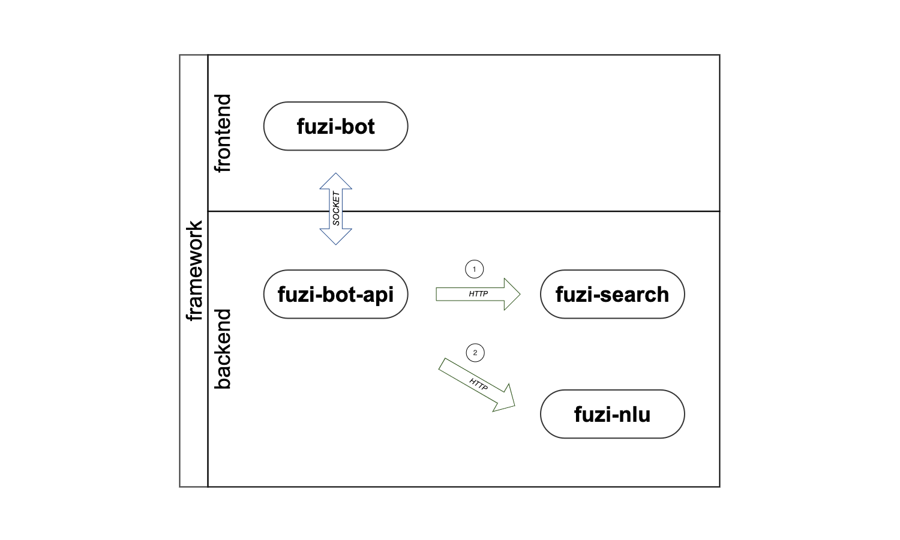
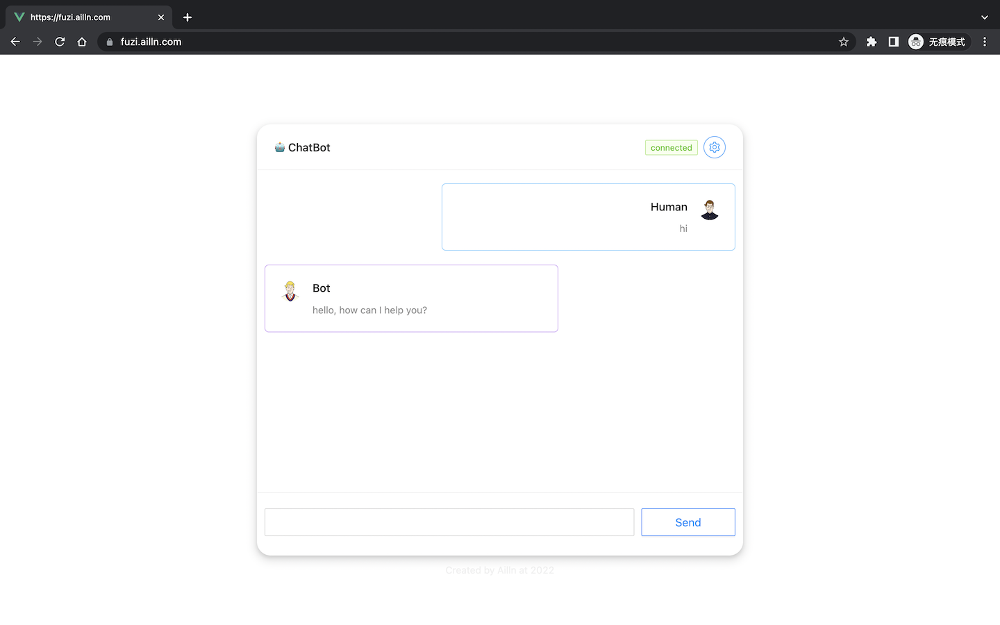

# FUZI SEARCH

[](https://github.com/Ailln/fuzi-search/blob/master/LICENSE)
[](https://github.com/Ailln/fuzi-search/stargazers)
[](https://github.com/Ailln/fuzi-search/network/members)

🤖️ 聊天机器人——`夫子`的「语义检索」模块。

## 1 简介

`夫子` 聊天机器人有 8 个模块组成：
1. [fuzi-bot](https://github.com/Ailln/fuzi-bot): 聊天界面模块，与用户进行交互。
2. [fuzi-bot-api](https://github.com/Ailln/fuzi-bot-api): 聊天接口模块，与其他后端模块通信。
3. [fuzi-nlu](https://github.com/Ailln/fuzi-nlu): 自然语言处理模块，理解用户的问题。
4. [fuzi-search](https://github.com/Ailln/fuzi-search): 语义检索模块，快速查找已有问题。
5. fuzi: 对话管理模块，推断用户的意图。
6. fuzi-admin: 后台管理模块，管理机器人的设置。
7. fuzi-admin-api: 后台管理接口，与其他后端模块通信。
8. fuzi-mark: 数据标注模块，标注用户的问题。



## 2 预览



[>> 点我立即尝试 <<](https://fuzi.ailln.com)

## 3 数据

[guotie dataset](./data/guotie)：这份数据集的主要内容是关于我家🐱——`锅贴`。

## 4 快速上手

```shell
git clone https://github.com/Ailln/fuzi-search.git
cd fuzi-search

# 使用 conda 虚拟环境（非必需）
conda create -n fuzi-search python==3.8.13 -y
conda activate fuzi-search

# 安装依赖
pip install -r requirements.txt
# 运行服务
python -m run.server
```

## 5 部署

### 5.1 Docker

```shell
git clone https://github.com/Ailln/fuzi-search.git

# 在 amd64 的 cpu 上
cd fuzi-search
# 打包
docker build -t fuzi-search:1.0.0 .
# 运行
docker run -d --restart=always --name fuzi-search -p 8082:8082 fuzi-search:1.0.0

# 在 arm64 的 cpu 上（比如树莓派）
cd fuzi-search
# 打包
docker build -t fuzi-search:1.0.0 -f deploy/arm64.Dockerfile .
# 运行
docker run -d --restart=always --name fuzi-search -p 8082:8082 fuzi-search:1.0.0
```

### 5.2 Kubernetes

```shell
cd fuzi-search

docker tag fuzi-search:1.0.0 192.168.2.101:5000/fuzi-search:1.0.0
docker push 192.168.2.101:5000/fuzi-search:1.0.0

kubectl apply -f deploy/deployment.yaml
```

## 6 许可证

[](./LICENSE)
[](https://github.com/Ailln/award)

## 7 交流

请添加微信号：`Ailln_`，备注「fuzi」，我邀请你进入交流群。
